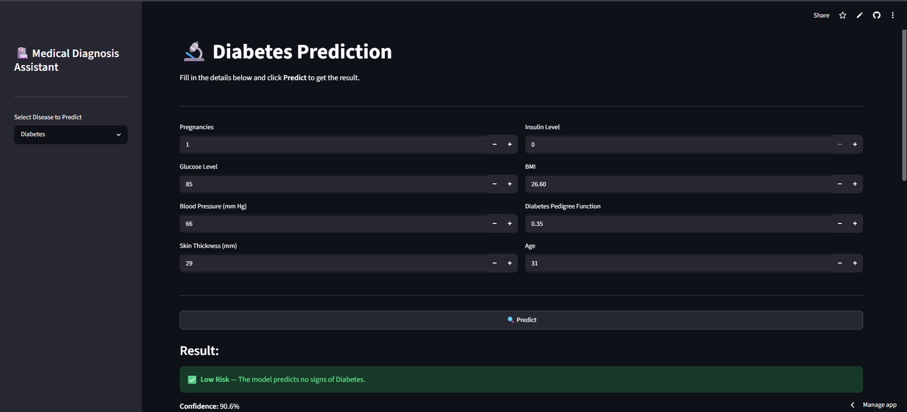
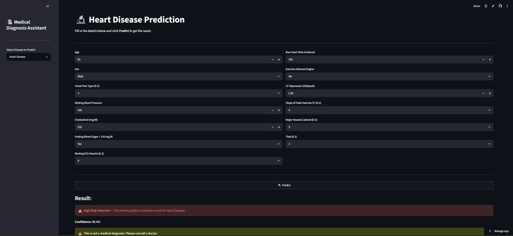
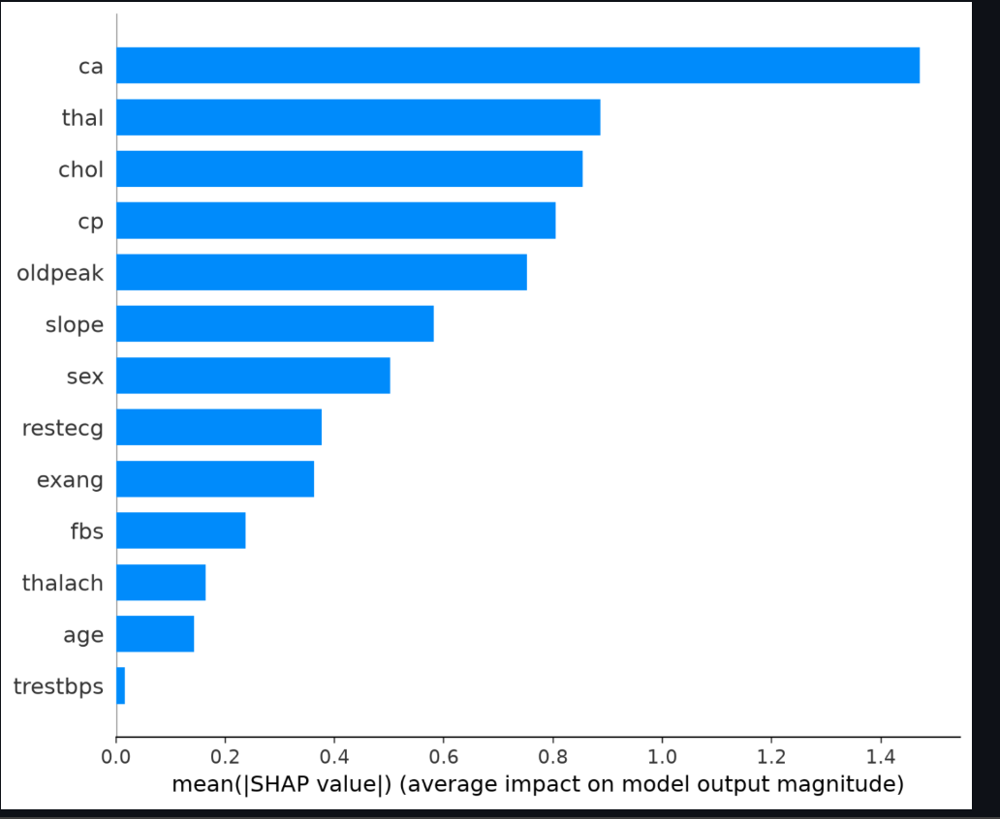
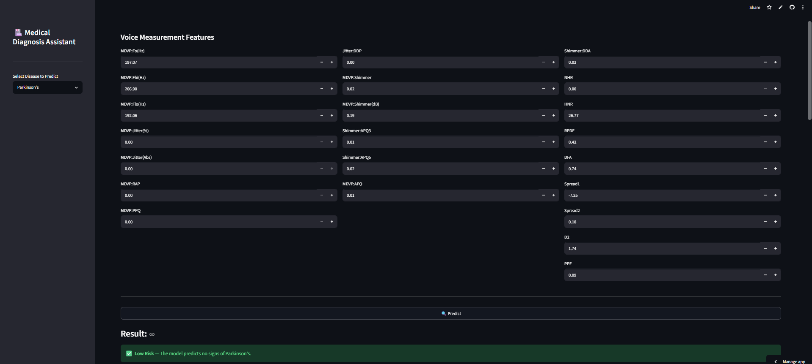
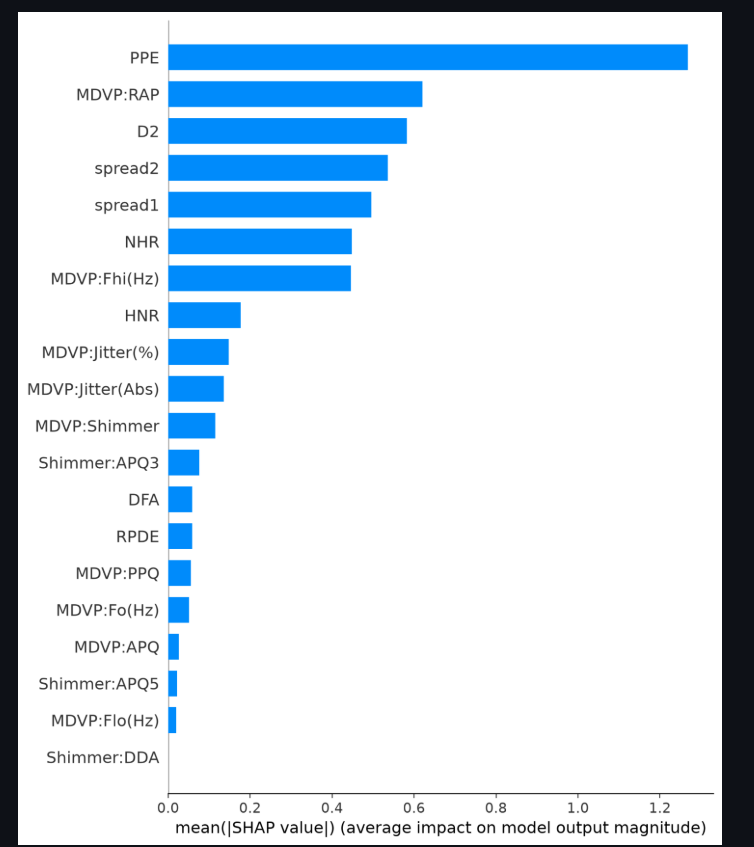

# 🏥 Medical Diagnosis Assistant

A machine learning web application that predicts the likelihood of three diseases — **Diabetes**, **Heart Disease**, and **Parkinson's** — using patient health data. Built with XGBoost and deployed with Streamlit.

🔗 **Live App:** https://medical-diagnosis-app-ngmqgym8egc8tz7zjgjw8p.streamlit.app/

---

## 🎯 Features

- Predict 3 diseases from a single unified interface
- Real-time predictions with confidence scores
- SHAP-based explainability — shows *why* the model made a prediction
- Clean, responsive UI built with Streamlit

---

## 🖥️ Screenshots

### Diabetes Prediction


### Heart Disease Prediction


### SHAP Explainability — Heart Disease


### Parkinson's Prediction


### SHAP Explainability — Parkinson's


---

## 🧠 Models & Accuracy

| Disease | Algorithm | Accuracy |
|---|---|---|
| Diabetes | XGBoost | 74% |
| Heart Disease | XGBoost | 98.54% |
| Parkinson's | XGBoost | 94.87% |

---

## 🛠️ Tech Stack

- **Python** — Core language
- **XGBoost** — ML model for all 3 diseases
- **Scikit-learn** — Data preprocessing & evaluation
- **SHAP** — Explainable AI (feature importance)
- **Streamlit** — Web app framework
- **Pandas / NumPy** — Data manipulation
- **Matplotlib / Seaborn** — Visualizations

---

## 📁 Project Structure
medical-diagnosis-app/

├── datasets/

│   ├── diabetes.csv

│   ├── heart.csv

│   └── parkinsons.csv

├── models/

│   ├── diabetes_model.pkl

│   ├── heart_model.pkl

│   └── parkinsons_model.pkl

├── notebooks/

│   ├── diabetes_model.ipynb

│   ├── heart_model.ipynb

│   └── parkinsons_model.ipynb

├── screenshots/

├── app.py

└── requirements.txt

---

## 🚀 Run Locally

```bash
# Clone the repo
git clone https://github.com/shre266/medical-diagnosis-app.git
cd medical-diagnosis-app

# Create virtual environment
python -m venv venv
venv\Scripts\activate

# Install dependencies
pip install -r requirements.txt

# Run the app
streamlit run app.py
```

---

## 📊 Datasets Used

- **Diabetes** — Pima Indians Diabetes Dataset
- **Heart Disease** — UCI Heart Disease Dataset
- **Parkinson's** — UCI Parkinson's Dataset

---

## 🔍 How SHAP Works

SHAP (SHapley Additive exPlanations) explains individual predictions by showing how much each feature contributed to the final output. Instead of a black-box prediction, the app shows *which health metrics drove the result* — making it transparent and trustworthy for medical use cases.

---

## ⚠️ Disclaimer

This app is for educational purposes only and is **not a substitute for professional medical advice**. Always consult a qualified healthcare provider for diagnosis and treatment.

---

## 👩‍💻 Author

**Shreya** — B.Tech AI & ML, BMSIT&M Bengaluru

[](https://github.com/shre266)